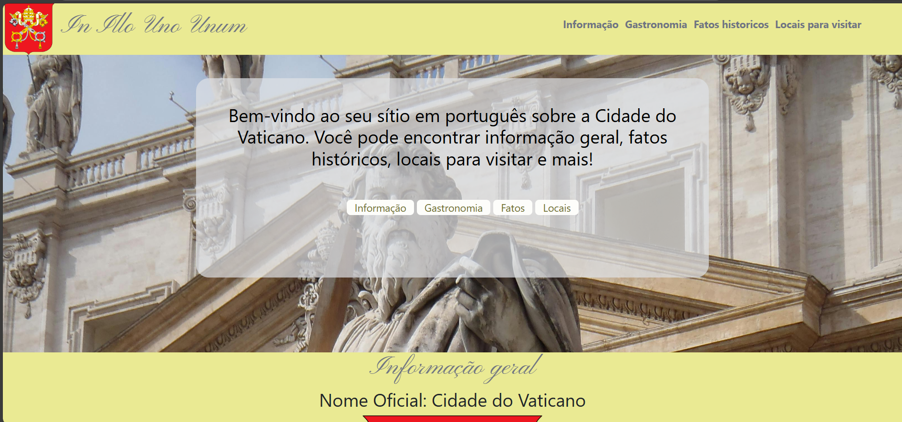
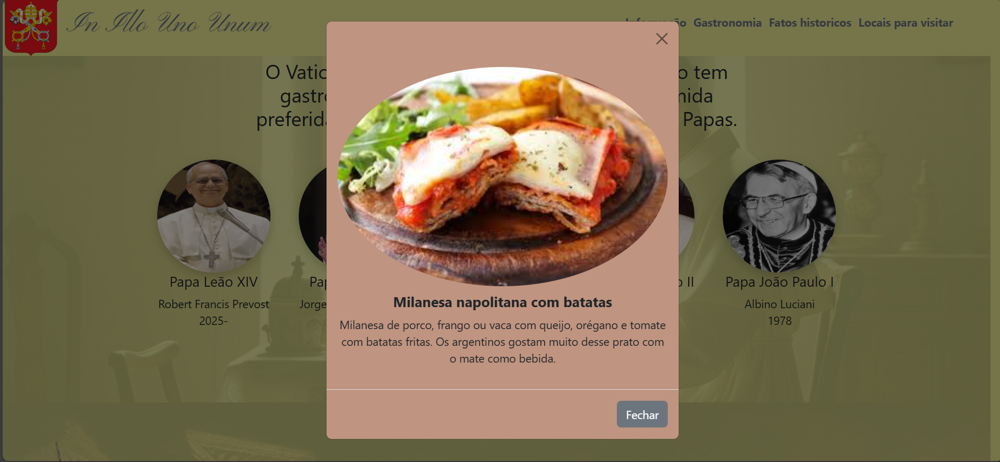
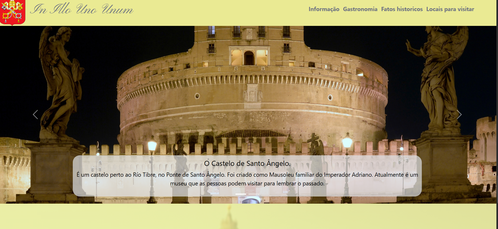
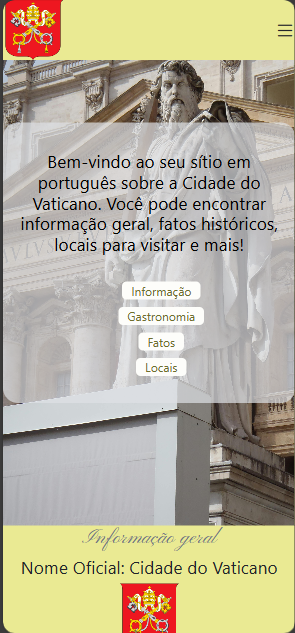

# Vatican City Information Page

**A clean, responsive frontend project demonstrating HTML, CSS, and Bootstrap skills.**  
Created as a final presentation for an intermediate Portuguese class while practicing professional web development workflows.

## Tech Stack
- **UX/UI Design:** Visily AI ([View Design](https://app.visily.ai/projects/e10e4a0f-f9aa-4080-af13-20645b9b5f40/boards/1962321/presenter?play-mode=All+screens))  
- **Frontend Development:** HTML, CSS  
- **Components & Interactions:** Bootstrap (modals, carousel, micro-interactions)  
- **Deployment:** GitHub Pages ([Click here to visit my page: ](https://alysoncastiblanco.github.io/CidadeDoVaticanoPage/))

## Highlights
- Informative, layered sections covering patriotic symbols, language, and historical facts with visual depth and opacity effects.  
- Interactive modals showcasing typical dishes of the last five Vatican sovereigns.  
- Responsive Bootstrap carousel featuring key tourist sites.  
- Carefully designed color palette reflecting Vatican colors.  
- Fully responsive across devices with precise Media Queries.  
- CSS-only hamburger menu with smooth toggle animations.  
- Smooth scrolling between sections for seamless navigation.

## Audience
- Junior developers and recruiters evaluating frontend skills.  
- Portuguese-speaking learners interested in cultural and historical content.

## Status
- Fully completed and functional across all devices.

## Screenshots
> Examples to showcase layout, responsiveness, and interactivity:
> 
> - **Homepage Overview:** Layered sections and content hierarchy.  
> - **Modals in Action:** Typical dishes of Vatican sovereigns.  
> - **Tourist Sites Carousel:** Interactive carousel with landmarks.  
> - **Mobile View:** Responsive design and CSS hamburger menu.

